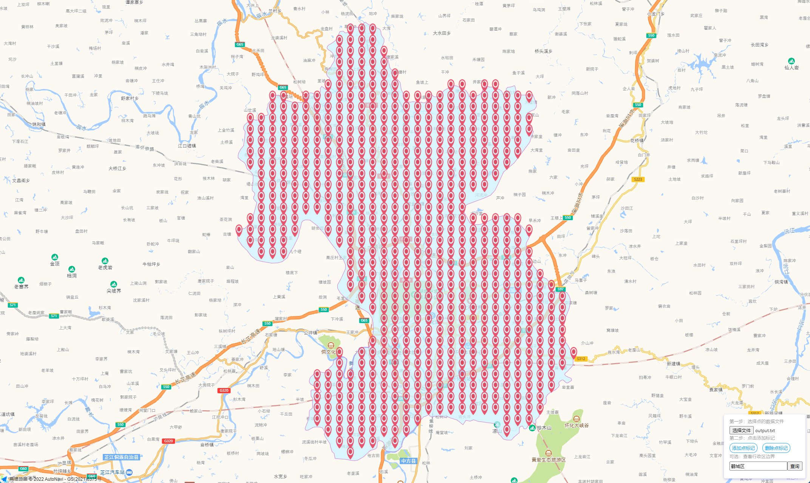

# points-in-area

specify polyline area and distance between each point , and generate points within the area. 

### how to use
depend on turfjs, so make sure you have install '@turf/turf' by
```
npm install @turf/turf
```
in your code
``` javascript
import PointsInArea from './points-in-area.js'

// Polyline data contains multi area group and each area group contains a latitude and  a longitude
// Each latitude and longitude group is separated by a semicolon, and different regions are separated by a vertical bar
// 110.058288,27.73632;110.0606,27.731306;110.061639,27.727857;110.061363,27.726446|110.059651,27.724253;110.057205,27.723463;110.053757,27.721768;110.052763,27.719838

const pta = new PointsInArea({ polyline: yourAreaInPolylineFormatData, pointGap: 1 })
const result = pta.run()
// result will be like 
// [
//   [ 109.7901243508548, 27.622294101818635 ],
//   [ 109.80025769413115, 27.622294101818635 ],
//   [ 109.80025769413115, 27.685246527279357 ]
// ]
```

you can test by run
``` bash
node test/index.js
```

and you can check these points in [preview-points](./docs/index.html)

